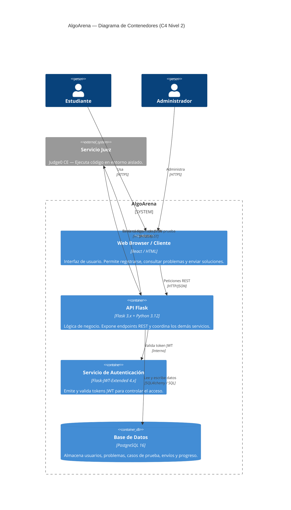

# Diagrama C4 — Nivel 2: Contenedores

Muestra los bloques tecnológicos principales de AlgoArena y cómo se comunican entre sí.

## Descripción de Contenedores

| Contenedor | Tecnología | Responsabilidad |
|---|---|---|
| Web Browser / Cliente | React / HTML | Interfaz de usuario |
| API Flask | Flask 3.x + Python 3.12 | Lógica de negocio y endpoints REST |
| Servicio de Autenticación | Flask-JWT-Extended | Emisión y validación de tokens JWT |
| Servicio Juez | Judge0 CE | Ejecución de código en entorno aislado |
| Base de Datos | PostgreSQL 16 | Persistencia de todos los datos del sistema |
