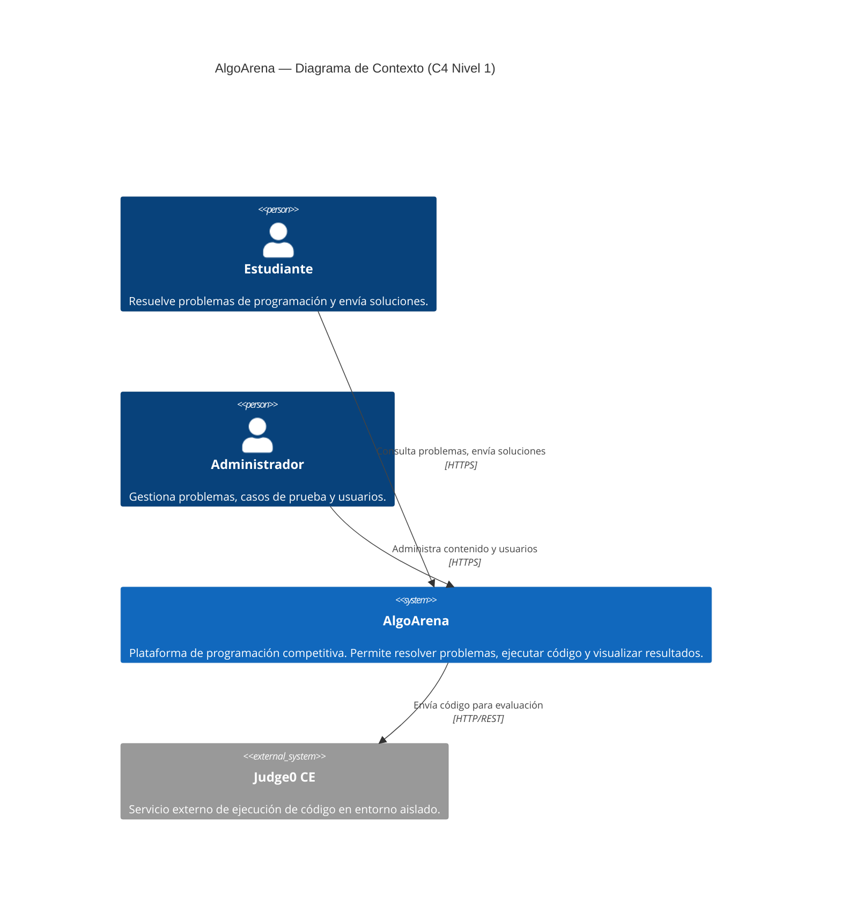

# Diagrama C4 — Nivel 1: Contexto del Sistema

Muestra los actores externos que interactúan con AlgoArena y los sistemas externos de los que depende.

```mermaid
C4Context
    title AlgoArena — Diagrama de Contexto (C4 Nivel 1)

    Person(estudiante, "Estudiante", "Resuelve problemas de programación y envía soluciones.")
    Person(admin, "Administrador", "Gestiona problemas, casos de prueba y usuarios.")

    System(algoarena, "AlgoArena", "Plataforma de programación competitiva. Permite resolver problemas, ejecutar código y visualizar resultados.")

    System_Ext(judge0, "Judge0 CE", "Servicio externo de ejecución de código en entorno aislado.")

    Rel(estudiante, algoarena, "Consulta problemas, envía soluciones", "HTTPS")
    Rel(admin, algoarena, "Administra contenido y usuarios", "HTTPS")
    Rel(algoarena, judge0, "Envía código para evaluación", "HTTP/REST")
```
