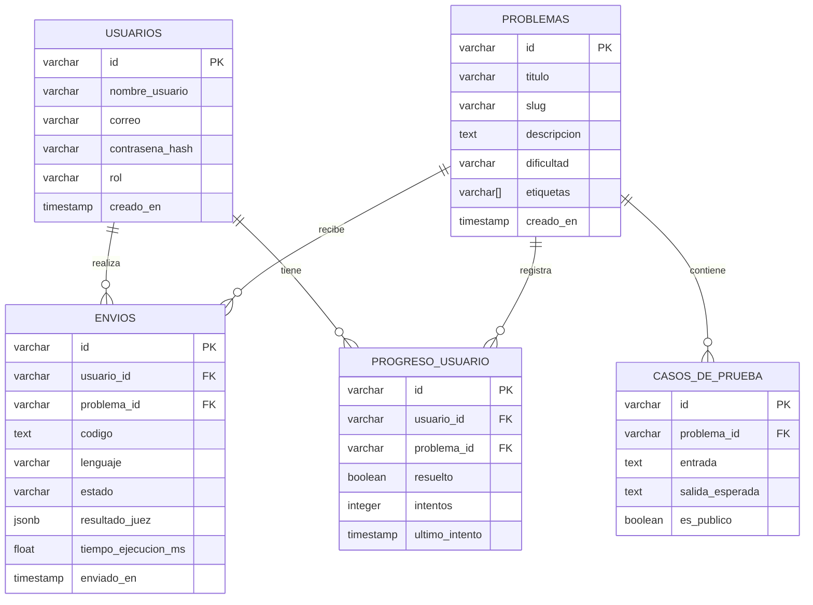

# Modelo de Datos — Diagrama ER

Modelo entidad-relación de las cinco tablas principales de AlgoArena.

## Detalle de Tablas

### `usuarios`
| Campo | Tipo | Restricción | Descripción |
|---|---|---|---|
| id | VARCHAR (UUID) | PK | Identificador único |
| nombre_usuario | VARCHAR(80) | UNIQUE, NOT NULL | Nombre de usuario |
| correo | VARCHAR(120) | UNIQUE, NOT NULL | Correo electrónico |
| contrasena_hash | VARCHAR(256) | NOT NULL | Hash bcrypt |
| rol | VARCHAR(20) | DEFAULT 'estudiante' | estudiante \| admin |
| creado_en | TIMESTAMP | DEFAULT NOW() | Fecha de registro |

### `problemas`
| Campo | Tipo | Restricción | Descripción |
|---|---|---|---|
| id | VARCHAR (UUID) | PK | Identificador único |
| titulo | VARCHAR(200) | NOT NULL | Título del problema |
| slug | VARCHAR(200) | UNIQUE | URL amigable (SEO) |
| descripcion | TEXT | NOT NULL | Enunciado completo |
| dificultad | VARCHAR(20) | NOT NULL | fácil \| medio \| difícil |
| etiquetas | VARCHAR[] | — | Array de etiquetas temáticas |
| creado_en | TIMESTAMP | DEFAULT NOW() | Fecha de creación |

### `envios`
| Campo | Tipo | Restricción | Descripción |
|---|---|---|---|
| id | VARCHAR (UUID) | PK | Identificador único |
| usuario_id | VARCHAR | FK → usuarios | Usuario que realizó el envío |
| problema_id | VARCHAR | FK → problemas | Problema resuelto |
| codigo | TEXT | NOT NULL | Código fuente enviado |
| lenguaje | VARCHAR(30) | NOT NULL | python \| java \| cpp |
| estado | VARCHAR(30) | NOT NULL | aceptado \| error \| pendiente |
| resultado_juez | JSONB | — | Respuesta completa de Judge0 |
| tiempo_ejecucion_ms | FLOAT | — | Tiempo de ejecución (ms) |
| enviado_en | TIMESTAMP | DEFAULT NOW() | Fecha y hora del envío |

### `casos_de_prueba`
| Campo | Tipo | Restricción | Descripción |
|---|---|---|---|
| id | VARCHAR (UUID) | PK | Identificador único |
| problema_id | VARCHAR | FK → problemas | Problema al que pertenece |
| entrada | TEXT | NOT NULL | Input del caso de prueba |
| salida_esperada | TEXT | NOT NULL | Output esperado |
| es_publico | BOOLEAN | DEFAULT FALSE | Visible para el usuario |

### `progreso_usuario`
| Campo | Tipo | Restricción | Descripción |
|---|---|---|---|
| id | VARCHAR (UUID) | PK | Identificador único |
| usuario_id | VARCHAR | FK → usuarios | Usuario |
| problema_id | VARCHAR | FK → problemas | Problema |
| resuelto | BOOLEAN | DEFAULT FALSE | Si fue resuelto correctamente |
| intentos | INTEGER | DEFAULT 0 | Número de intentos realizados |
| ultimo_intento | TIMESTAMP | — | Fecha del último intento |
