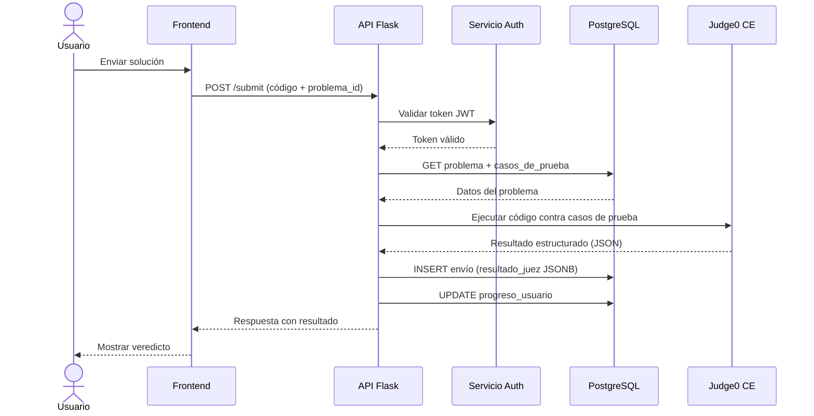

# Diagrama de Flujo — Envío de Código

Flujo completo de la operación de envío de solución desde el cliente hasta el veredicto final.

## Principios de Diseño Aplicados

- **Separación de responsabilidades:** cada contenedor tiene una función bien definida y acotada.
- **Comunicación asíncrona potencial:** el Servicio Juez puede evolucionar a un modelo de colas (Celery + Redis) para alta concurrencia.
- **Seguridad perimetral:** todos los endpoints protegidos requieren token JWT válido.
- **Extensibilidad:** la arquitectura permite añadir nuevos jueces o microservicios sin modificar la API principal.
