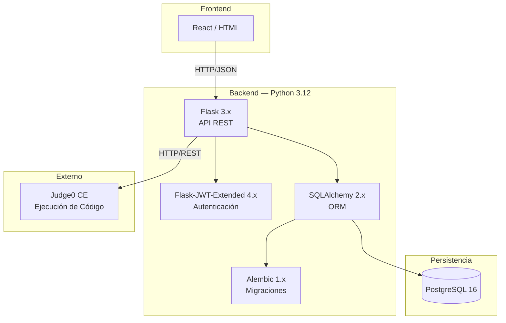

# Stack Tecnológico

Diagrama del stack completo de AlgoArena y las relaciones entre sus componentes.

## Tabla de Componentes

| Componente | Tecnología | Versión | Rol |
|---|---|---|---|
| Lenguaje | Python | 3.12 | Backend principal |
| Framework web | Flask | 3.x | API REST |
| ORM | SQLAlchemy | 2.x | Abstracción de BD |
| Migraciones | Alembic | 1.x | Versionado de esquema |
| Base de datos | PostgreSQL | 16 | Persistencia |
| Autenticación | Flask-JWT-Extended | 4.x | Tokens JWT |
| Juez de código | Judge0 CE | — | Ejecución y evaluación |
